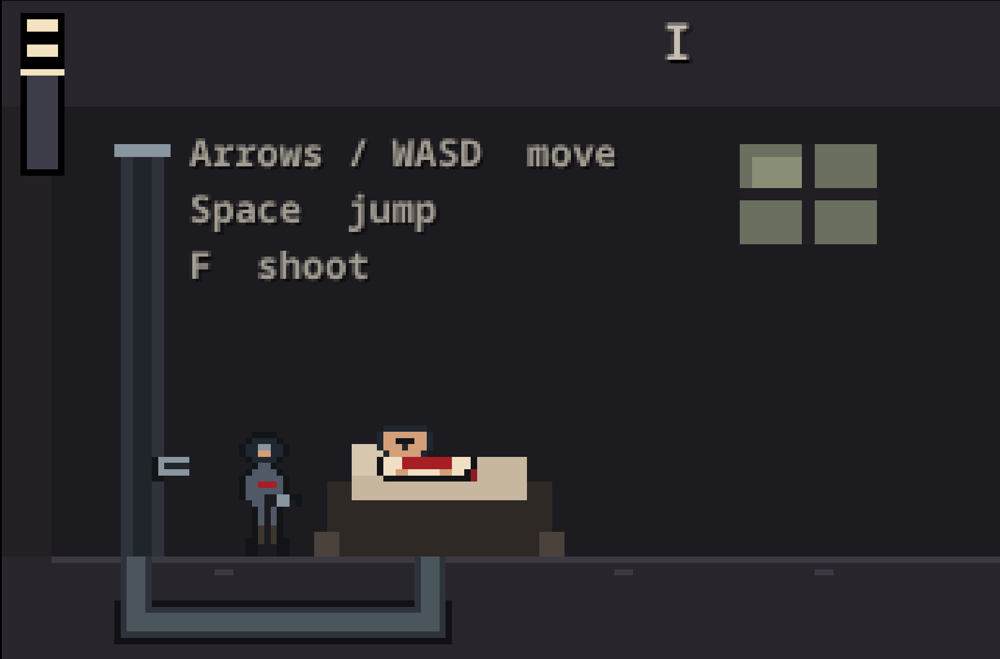

# Unicorn Resurrection

**How many times would you bring her back?**

Your mother is dead. Unicorn blood can bring her back, but it cannot keep her safe.

Fight your way through a pixel run-and-gun built for [js13k](https://js13kgames.com/) 2026. Kill unicorns, collect their blood before it disappears, and get back to the hospital with a full vat. Your mother wakes. Another unicorn takes her away. You head out again.

Each trip gets harder. You can keep fighting for one more moment with her, or learn to say goodbye.



## Play Online

Author Hosted: [Try on Browser (Desktop or Mobile)](https://unicorn-resurrection-dot-shafayets-toolchain.uc.r.appspot.com//)

## Controls

| Action | Keyboard | Gamepad / touch |
| --- | --- | --- |
| Move | Arrows / WASD | D-pad / stick / on-screen pads |
| Jump, pause, let go | Space | A |
| Shoot, pour, continue | F | X |


## Run Locally

```bash
npm install
npm run serve
```

Then open [http://localhost:3000](http://localhost:3000).

## Author

**Sayem Shafayet**  
[sayemshafayet.com](https://sayemshafayet.com)

## Starter kit

This project is built on the [JS13K TypeScript Starter](https://github.com/roblouie/js13k-typescript-starter). 
